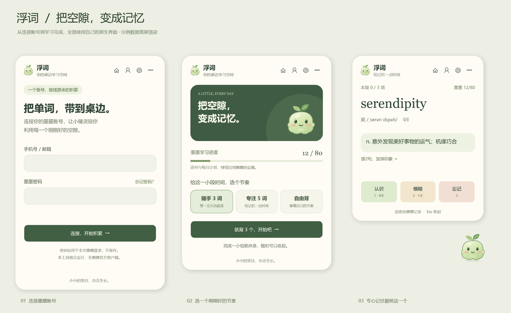
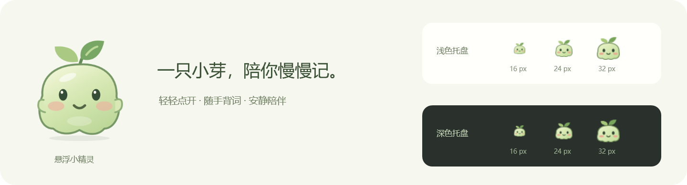

# 浮词 WordBubble

让背单词留在桌边：点开一只小精灵，学几个词，再安静地收起。

浮词是一个连接墨墨账号的 **Windows 桌面背词工具**。它提供独立设计的原生界面，用可拖动的气泡和小卡片完成日常复习。**本项目由社区独立开发，非墨墨官方客户端，与墨墨无隶属关系。**



## 能做什么

- **随手背一小组**：随手 3 词、专注 5 词、自由背，适合等待和工作的间隙。
- **轻巧的小精灵**：拖动定位、靠边吸附，点击就地展开；悬停和操作时有轻微表情反馈。
- **完整的单词卡片**：回忆、查看释义、发音、认识 / 模糊 / 忘记反馈，以及网页当前提供的拼写题。
- **先读英文，再看翻译**：释义页按实际例句数量显示“读N句，加深印象”，展开后逐句阅读英文。点击某句的“显示翻译”才读取并展示该句中文，收起或换词后恢复英文。拼写题仅显示官网当前提供的提示例句。
- **沿用墨墨学习进度**：读取官网当前内容，将操作交给官网提交；继续使用自己的词书、计划和记忆算法。
- **随时收起**：支持全局快捷键、全屏时自动收起、会议模式、置顶与气泡透明度设置。



## 下载与启动

当前版本：**0.3.4**。运行环境为 **Windows 10 / 11 x64**。

1. 在本仓库的 **Releases** 页面下载 `WordBubble-0.3.4-win-x64.zip`。如果还没有发布包，可以按下文从源码构建。
2. **完整解压**到一个本地目录，运行其中的 `WordBubble.exe`，不要只复制 exe。
3. 电脑需要安装 [Microsoft Edge WebView2 Evergreen Runtime](https://developer.microsoft.com/microsoft-edge/webview2/)。发布包自带 .NET 运行时，普通用户无需另装 .NET SDK。

升级时，先在系统托盘右键选择“退出浮词”，再解压并运行新版。不同版本共用本机登录会话和偏好设置。程序不包含自动更新和开机启动功能。

## 第一次使用

1. 点击桌面小精灵，使用墨墨的 **手机号 / 邮箱和密码**连接账号。已有登录会话会尝试自动恢复，卡片顶部的账号按钮可检查登录。
2. 如果墨墨显示网页版公测说明，请阅读说明、服务条款及隐私政策，自行选择是否同意，再点击“开始学习”。账号是否具有网页版资格由墨墨决定。
3. 按[墨墨网页版说明](https://memodocs.maimemo.com/docs/memo-web_study)在墨墨 App 中开启学习数据自动同步。先在 App 中设置好词书与每日学习计划，并完成同步。
4. 在浮词选择 **随手 3 词 / 专注 5 词 / 自由背**，开始学习。小组模式只控制这次停下休息的时机，不会修改墨墨每日计划。
5. 先回忆，再查看释义并如实反馈。完成一小组后，可以继续或收起；网页当前轮结束后的额外复习、签到等操作也需要自行点击。

### 常用操作

| 操作 | 方式 |
| --- | --- |
| 展开 / 收起学习卡 | 点击小精灵，或 `Ctrl + Alt + M` |
| 收起卡片 | `Esc` 或右上角收起按钮 |
| 查看释义 / 答案 | `Space` 或卡片按钮 |
| 认识 / 模糊 / 忘记 | 当前卡片对应的 `1` / `2` / `3` 按钮 |
| 核对拼写 | 在拼写框输入后按 `Enter` |
| 移动气泡 | 按住小精灵拖动，靠近屏幕边缘会吸附 |
| 设置 / 会议模式 / 退出 | 小精灵或系统托盘图标的右键菜单 |

学习快捷键只在卡片获得焦点、且没有输入文字时响应，不影响账号、密码或拼写输入。全局快捷键可以在设置中更换。发音只在明确点击时播放，收起卡片会立即静音。

## 同步方式与功能范围

浮词使用 **WPF 原生界面 + 后台 WebView2 官方网页会话**。登录、学习按钮和进度由适配层连接到墨墨网页当前的真实控件；用户看到的是浮词自己的界面。

- 本项目目前不使用开放 API 写入学习记录，也不维护第二套记忆算法。反馈是否提交成功、学习进度是否更新，取决于官方服务的处理结果。
- 3 / 5 词的小组进度依据官网已完成数的变化，不按点击次数累计；未知进度不会显示为虚构数字。
- 词书、每日计划和账号管理继续在墨墨官方应用中操作。选书、购买、搜索词库、完整笔记编辑等功能不在当前范围内。
- 原生登录支持手机号 / 邮箱与密码，暂不支持微信扫码、注册和复杂人机验证。
- 学习需要联网；没有离线正式背词和本地待同步队列。收起会保留后台会话，退出会关闭连接。
- 官网页面结构或登录策略变化可能导致适配失效。遇到无法识别的状态，浮词会停止提交并提示重连。

跨设备同步请以墨墨各端同步后的结果为准。浮词不会绕过官方的资格检查、协议确认或账号限制。

## 常见问题

| 情况 | 建议 |
| --- | --- |
| 一直显示连接中，或提示连接中断 | 检查网络与 WebView2 Runtime；点击“重新连接”。仍失败时，从托盘退出后重新启动。 |
| 找不到登录入口，或登录态失效 | 点击卡片顶部账号图标，或错误页的“检查账号登录”。 |
| 登录后没有可学习内容 / 提示无网页版资格 | 在墨墨 App 检查词书、计划、自动同步及网页版使用要求；这些由官方服务控制。 |
| 进度和手机不一致 | 先确认两个客户端使用同一个墨墨账号，并在 App 完成同步，再在浮词重新连接。不要仅凭点击次数判断同步成功。 |
| 点击快捷键没有反应 | 快捷键可能被其他程序占用，先点击小精灵进入，再在设置中更换组合键。 |
| 气泡或卡片找不到了 | 点击托盘图标恢复；检查会议模式和全屏自动收起设置，或选择“把窗口移回当前屏幕”。 |
| 发音没有声音 | 点击发音按钮，并检查 Windows 音量混合器、输出设备和网络；后台网页默认保持静音。 |
| 新版本启动后仍像旧版 | 先通过托盘退出旧进程，再启动新版。仅关闭学习卡片不会退出程序。 |

仍有问题时，可在本仓库的 Issues 中使用问题反馈模板，提供版本、系统和复现步骤。请勿公开账号、密码、登录会话目录或未检查的诊断日志。

## 本地数据与隐私

默认数据目录为 `%LOCALAPPDATA%\WordBubble\`：

| 内容 | 用途 |
| --- | --- |
| `settings.json` | 气泡位置、快捷键、置顶、透明度、小组模式等偏好 |
| `BrowserProfile/` | WebView2 管理的 Cookie、缓存和网站存储，用于保留墨墨登录态 |

账号与密码在提交时用于墨墨官方登录表单。浮词不保存明文密码；原生密码框在提交、收起和关闭时清空。程序没有自建账号服务器和遥测，不主动读取或导出 Cookie / Token。网络请求由墨墨官网及其依赖资源处理，受墨墨相应政策约束。

`BrowserProfile/` 包含敏感的登录会话，请勿复制到公共仓库或发给他人。调试产生的日志、真实账号截图及测试会话也应留在本地。仓库的 `.gitignore` 会排除常见的本地数据和生成文件，但上传前仍应检查暂存内容。

## 从源码开发

需要 Windows、[.NET 10 SDK](https://dotnet.microsoft.com/download/dotnet/10.0)、WebView2 Runtime。运行 JavaScript 适配器测试还需要 Node.js 22 或更新的受支持版本及 npm。

在仓库根目录打开 PowerShell：

```powershell
# 构建及启动应用
dotnet build .\src\WordBubble\WordBubble.csproj -c Release
dotnet run --project .\src\WordBubble\WordBubble.csproj

# 核心逻辑检查（本项目使用控制台测试程序）
dotnet run --project .\tests\WordBubble.Tests\WordBubble.Tests.csproj

# DOM 适配器测试：使用本地样本，无需真实墨墨账号
Push-Location .\tests\adapter
npm ci
npm test
Pop-Location

# 使用示例数据生成原生界面预览，不连接真实账号
dotnet run --project .\scripts\PreviewRenderer\PreviewRenderer.csproj -c Release -- artifacts/native-preview

# 生成 Windows x64 发布目录和 ZIP
.\scripts\publish.ps1
```

发布结果默认位于 `dist/WordBubble-0.3.4/` 和 `dist/WordBubble-0.3.4-win-x64.zip`。脚本优先使用本地 `.tools/dotnet/` 中的 SDK（如果存在），否则使用系统 `dotnet`。已有非空输出目录时会停止，避免把旧文件混入安装包；重新打包可指定新的 `-OutputName`。构建输出、依赖缓存和发布包不应提交到 Git，ZIP 可作为 GitHub Release 附件发布。

### 项目结构

```text
src/WordBubble/             WPF 应用、气泡、学习卡片、设置与连接层
  Assets/                  图标、学习及登录页面适配器
  Core/                    学习小组、设置、定位及导航规则
tests/WordBubble.Tests/    .NET 核心逻辑检查
tests/adapter/             JavaScript DOM 样本测试与 npm 锁文件
scripts/PreviewRenderer/  原生界面离屏预览与流程断言
scripts/create-icon.ps1   图标生成脚本
scripts/publish.ps1       Windows x64 打包脚本
docs/images/              使用示例数据生成的公开预览图
```

更详细的修改和测试约定见 [CONTRIBUTING.md](CONTRIBUTING.md)。自动检查不能代替真实 Windows 环境验证，尤其是多屏缩放、长期运行、官网改版及具体账号的登录流程。

准备建立自己的 GitHub 仓库或发布安装包时，可按[仓库与发布整理说明](docs/PUBLISHING.md)操作。GitHub Actions 会检查构建与本地样本测试，不自动登录或发布。

## 贡献与许可

欢迎通过 Issue 提交可复现的问题和使用建议，或提交范围清晰的 Pull Request。修改官网适配器时，请尽量提供去除个人数据的最小 DOM 样本和回归测试。

本项目源码按 [MIT License](LICENSE) 发布；第三方依赖说明见 [THIRD_PARTY_NOTICES.md](THIRD_PARTY_NOTICES.md)。墨墨的名称、服务、学习内容及相关标识不属于本项目的授权范围，使用时仍需遵守相应服务条款。
